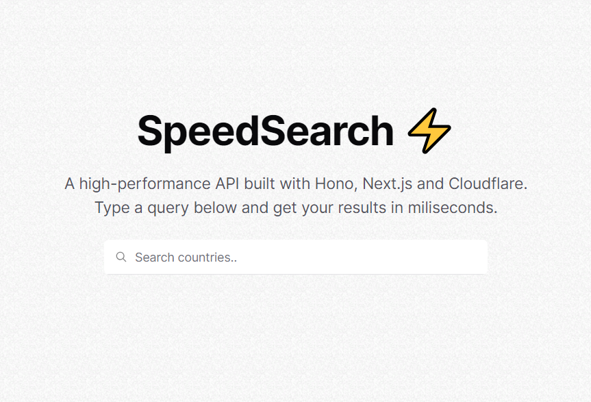

# Speed Search ⚡

A high-performance API built with Hono, Next.js and Cloudflare.
Type a query below and get your results in miliseconds.



## Tech Stack Used

- Next.js
- Hono
- Redis(upstash)
- Shadcn-ui

## Setup on your local Machine

- Fork your own copy of the repository
- Clone in using the `git clone <url>`

- Create a `.env` file in the root directory with your token and urls from Upstash

```
UPSTASH_REDIS_REST_TOKEN=
UPSTASH_REDIS_REST_URL=
```

- Open terminal and run the following commands

```
cd speed-search
npm install
```

- Deploy the backend to couldflare workers by running `npm run deploy`

- Run the frontend on localhost using `npm run dev`
